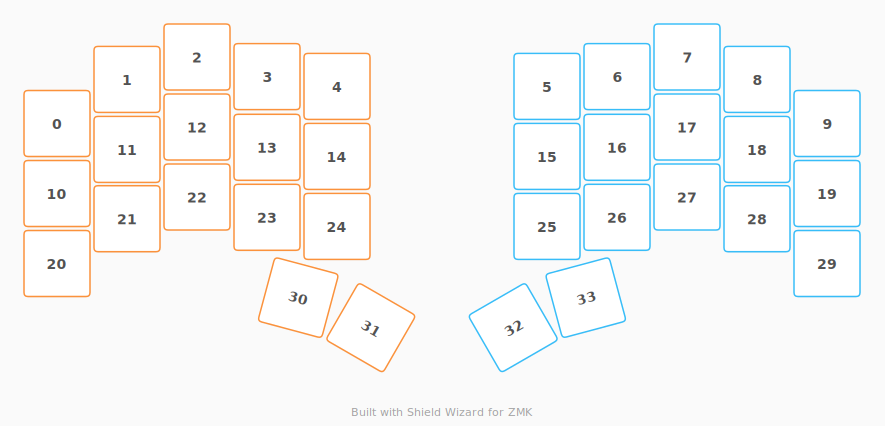

# ZMK Configuration for pisey

*Generated by Shield Wizard for ZMK*



Download compiled firmware from the Actions tab. <https://zmk.dev/docs/user-setup#installing-the-firmware>

Edit your keymap <https://zmk.dev/docs/keymaps>.
User keymap is located at [`config/pisey.keymap`](config/pisey.keymap).

-----

<details>
<summary>
Shield Wizard Debug Information
</summary>

In case of broken configuration, here is the Shield Wizard internal data used to generate this configuration:

Commit: d97539af50adf6e6b814e78f61634808d9217881

```json
{"name":"pisey","shield":"pisey","dongle":true,"modules":[],"layout":[{"id":"01KWNYVF6TPN9WFV7G2BYKGH24","part":0,"row":0,"col":0,"w":1,"h":1,"x":0,"y":0.95,"r":0,"rx":0,"ry":0},{"id":"01KWNYVF6T42SC39T538M7SHCW","part":0,"row":0,"col":1,"w":1,"h":1,"x":1,"y":0.32,"r":0,"rx":0,"ry":0},{"id":"01KWNYVF6TW1QKWYZ8FZPD4K8W","part":0,"row":0,"col":2,"w":1,"h":1,"x":2,"y":0,"r":0,"rx":0,"ry":0},{"id":"01KWNYVF6TA2CFJXDSZDCYNK6N","part":0,"row":0,"col":3,"w":1,"h":1,"x":3,"y":0.28,"r":0,"rx":0,"ry":0},{"id":"01KWNYVF6TRHYVF8MZ7HTP8WWD","part":0,"row":0,"col":4,"w":1,"h":1,"x":4,"y":0.42,"r":0,"rx":0,"ry":0},{"id":"01KWNYVF6TTRCM7X9JZ443D9G4","part":1,"row":0,"col":5,"w":1,"h":1,"x":7,"y":0.42,"r":0,"rx":0,"ry":0},{"id":"01KWNYVF6TPH822RJT5EPKD9JT","part":1,"row":0,"col":6,"w":1,"h":1,"x":8,"y":0.28,"r":0,"rx":0,"ry":0},{"id":"01KWNYVF6T4CYC1S0E9CER2TD9","part":1,"row":0,"col":7,"w":1,"h":1,"x":9,"y":0,"r":0,"rx":0,"ry":0},{"id":"01KWNYVF6TFH5Z3MY9N8R2VKR0","part":1,"row":0,"col":8,"w":1,"h":1,"x":10,"y":0.32,"r":0,"rx":0,"ry":0},{"id":"01KWNYVF6TCHFW0KCVXY5ZR3FA","part":1,"row":0,"col":9,"w":1,"h":1,"x":11,"y":0.95,"r":0,"rx":0,"ry":0},{"id":"01KWNYVF6TMVZT0V0WPBWJ94XG","part":0,"row":1,"col":0,"w":1,"h":1,"x":0,"y":1.95,"r":0,"rx":0,"ry":0},{"id":"01KWNYVF6TJ29FA7SCA5HYWG8A","part":0,"row":1,"col":1,"w":1,"h":1,"x":1,"y":1.32,"r":0,"rx":0,"ry":0},{"id":"01KWNYVF6TY22WYY671RHHP6WM","part":0,"row":1,"col":2,"w":1,"h":1,"x":2,"y":1,"r":0,"rx":0,"ry":0},{"id":"01KWNYVF6T871DRSM33KGJXKD0","part":0,"row":1,"col":3,"w":1,"h":1,"x":3,"y":1.29,"r":0,"rx":0,"ry":0},{"id":"01KWNYVF6T7JJ7QMDH57BEW8BR","part":0,"row":1,"col":4,"w":1,"h":1,"x":4,"y":1.42,"r":0,"rx":0,"ry":0},{"id":"01KWNYVF6T0RQNFSXG7W8A5JE2","part":1,"row":1,"col":5,"w":1,"h":1,"x":7,"y":1.42,"r":0,"rx":0,"ry":0},{"id":"01KWNYVF6T65KQPKVMV501SWGX","part":1,"row":1,"col":6,"w":1,"h":1,"x":8,"y":1.29,"r":0,"rx":0,"ry":0},{"id":"01KWNYVF6TT4FECGZWCTRPZ37R","part":1,"row":1,"col":7,"w":1,"h":1,"x":9,"y":1,"r":0,"rx":0,"ry":0},{"id":"01KWNYVF6T1Z3X2HBNFNF6R07T","part":1,"row":1,"col":8,"w":1,"h":1,"x":10,"y":1.32,"r":0,"rx":0,"ry":0},{"id":"01KWNYVF6TFDMH12JCVF3F6GR2","part":1,"row":1,"col":9,"w":1,"h":1,"x":11,"y":1.95,"r":0,"rx":0,"ry":0},{"id":"01KWNYVF6TNMT5F9NKXG9YECYR","part":0,"row":2,"col":0,"w":1,"h":1,"x":0,"y":2.95,"r":0,"rx":0,"ry":0},{"id":"01KWNYVF6TQASFZBH690E5YHKJ","part":0,"row":2,"col":1,"w":1,"h":1,"x":1,"y":2.31,"r":0,"rx":0,"ry":0},{"id":"01KWNYVF6TQJPQP21G3MCQRE7W","part":0,"row":2,"col":2,"w":1,"h":1,"x":2,"y":2,"r":0,"rx":0,"ry":0},{"id":"01KWNYVF6TMXTKTJHG5ZZZQEEM","part":0,"row":2,"col":3,"w":1,"h":1,"x":3,"y":2.29,"r":0,"rx":0,"ry":0},{"id":"01KWNYVF6TER4462ZMN12CC5JE","part":0,"row":2,"col":4,"w":1,"h":1,"x":4,"y":2.42,"r":0,"rx":0,"ry":0},{"id":"01KWNYVF6T6A3N698Y0T6TQ0TM","part":1,"row":2,"col":5,"w":1,"h":1,"x":7,"y":2.42,"r":0,"rx":0,"ry":0},{"id":"01KWNYVF6TCQTKAAR9HW1NNR6K","part":1,"row":2,"col":6,"w":1,"h":1,"x":8,"y":2.29,"r":0,"rx":0,"ry":0},{"id":"01KWNYVF6T2728GP558WQPMBHA","part":1,"row":2,"col":7,"w":1,"h":1,"x":9,"y":2,"r":0,"rx":0,"ry":0},{"id":"01KWNYVF6TCG3EW24Q694FSR6V","part":1,"row":2,"col":8,"w":1,"h":1,"x":10,"y":2.31,"r":0,"rx":0,"ry":0},{"id":"01KWNYVF6TS0SNZ2B5VW22RNXG","part":1,"row":2,"col":9,"w":1,"h":1,"x":11,"y":2.95,"r":0,"rx":0,"ry":0},{"id":"01KWNYVF6TSEXP8XMJFSY9GT27","part":0,"row":3,"col":3,"w":1,"h":1,"x":3.3,"y":3.55,"r":15,"rx":4.3,"ry":4.55},{"id":"01KWNYVF6TB285SVHVA1T0N48J","part":0,"row":3,"col":4,"w":1,"h":1,"x":4.3,"y":3.55,"r":30,"rx":4.3,"ry":4.55},{"id":"01KWNYVF6TZZXWWJ4DK36XNDQQ","part":1,"row":3,"col":5,"w":1,"h":1,"x":6.7,"y":3.55,"r":-30,"rx":7.7,"ry":4.55},{"id":"01KWNYVF6TCN9JJG1CGQ6Q233M","part":1,"row":3,"col":6,"w":1,"h":1,"x":7.7,"y":3.55,"r":-15,"rx":7.7,"ry":4.55}],"parts":[{"name":"left","controller":"nice_nano_v2","pins":{"d9":{"usage":"kscan","kscan":"01KWP00TR1W4AW3TWNJ8PR2MN2","role":"output"},"d7":{"usage":"kscan","kscan":"01KWP00TR1W4AW3TWNJ8PR2MN2","role":"output"},"d6":{"usage":"kscan","kscan":"01KWP00TR1W4AW3TWNJ8PR2MN2","role":"output"},"d5":{"usage":"kscan","kscan":"01KWP00TR1W4AW3TWNJ8PR2MN2","role":"output"},"d10":{"usage":"kscan","kscan":"01KWP00TR1W4AW3TWNJ8PR2MN2","role":"input"},"d16":{"usage":"kscan","kscan":"01KWP00TR1W4AW3TWNJ8PR2MN2","role":"input"},"d14":{"usage":"kscan","kscan":"01KWP00TR1W4AW3TWNJ8PR2MN2","role":"input"},"d15":{"usage":"kscan","kscan":"01KWP00TR1W4AW3TWNJ8PR2MN2","role":"input"},"d18":{"usage":"kscan","kscan":"01KWP00TR1W4AW3TWNJ8PR2MN2","role":"input"}},"kscans":[{"kind":"matrix","id":"01KWP00TR1W4AW3TWNJ8PR2MN2","diodes":true}],"keys":{"01KWNYVF6TNMT5F9NKXG9YECYR":{"input":"d18","output":"d7"},"01KWNYVF6TQASFZBH690E5YHKJ":{"input":"d15","output":"d7"},"01KWNYVF6TQJPQP21G3MCQRE7W":{"input":"d14","output":"d7"},"01KWNYVF6TMXTKTJHG5ZZZQEEM":{"input":"d16","output":"d7"},"01KWNYVF6TER4462ZMN12CC5JE":{"input":"d10","output":"d7"},"01KWNYVF6TSEXP8XMJFSY9GT27":{"input":"d16","output":"d9"},"01KWNYVF6TB285SVHVA1T0N48J":{"input":"d10","output":"d9"},"01KWNYVF6T7JJ7QMDH57BEW8BR":{"input":"d10","output":"d6"},"01KWNYVF6TRHYVF8MZ7HTP8WWD":{"input":"d10","output":"d5"},"01KWNYVF6T871DRSM33KGJXKD0":{"input":"d16","output":"d6"},"01KWNYVF6TA2CFJXDSZDCYNK6N":{"input":"d16","output":"d5"},"01KWNYVF6TY22WYY671RHHP6WM":{"input":"d14","output":"d6"},"01KWNYVF6TW1QKWYZ8FZPD4K8W":{"input":"d14","output":"d5"},"01KWNYVF6TJ29FA7SCA5HYWG8A":{"input":"d15","output":"d6"},"01KWNYVF6T42SC39T538M7SHCW":{"input":"d15","output":"d5"},"01KWNYVF6TMVZT0V0WPBWJ94XG":{"input":"d18","output":"d6"},"01KWNYVF6TPN9WFV7G2BYKGH24":{"input":"d18","output":"d5"}},"encoders":[],"buses":{}},{"name":"right","controller":"nice_nano_v2","pins":{"d10":{"usage":"kscan","kscan":"01KWQ7G4KV8XY58JCRQ5PM6FTC","role":"output"},"d14":{"usage":"kscan","kscan":"01KWQ7G4KV8XY58JCRQ5PM6FTC","role":"output"},"d15":{"usage":"kscan","kscan":"01KWQ7G4KV8XY58JCRQ5PM6FTC","role":"output"},"d18":{"usage":"kscan","kscan":"01KWQ7G4KV8XY58JCRQ5PM6FTC","role":"output"},"d9":{"usage":"kscan","kscan":"01KWQ7G4KV8XY58JCRQ5PM6FTC","role":"input"},"d8":{"usage":"kscan","kscan":"01KWQ7G4KV8XY58JCRQ5PM6FTC","role":"input"},"d7":{"usage":"kscan","kscan":"01KWQ7G4KV8XY58JCRQ5PM6FTC","role":"input"},"d6":{"usage":"kscan","kscan":"01KWQ7G4KV8XY58JCRQ5PM6FTC","role":"input"},"d5":{"usage":"kscan","kscan":"01KWQ7G4KV8XY58JCRQ5PM6FTC","role":"input"}},"kscans":[{"kind":"matrix","id":"01KWQ7G4KV8XY58JCRQ5PM6FTC","diodes":true}],"keys":{"01KWNYVF6TZZXWWJ4DK36XNDQQ":{"input":"d9","output":"d10"},"01KWNYVF6TCN9JJG1CGQ6Q233M":{"input":"d8","output":"d10"},"01KWNYVF6T6A3N698Y0T6TQ0TM":{"input":"d9","output":"d14"},"01KWNYVF6TCQTKAAR9HW1NNR6K":{"input":"d8","output":"d14"},"01KWNYVF6T2728GP558WQPMBHA":{"input":"d7","output":"d14"},"01KWNYVF6TCG3EW24Q694FSR6V":{"input":"d6","output":"d14"},"01KWNYVF6TS0SNZ2B5VW22RNXG":{"input":"d5","output":"d14"},"01KWNYVF6T0RQNFSXG7W8A5JE2":{"input":"d9","output":"d15"},"01KWNYVF6T65KQPKVMV501SWGX":{"input":"d8","output":"d15"},"01KWNYVF6TT4FECGZWCTRPZ37R":{"input":"d7","output":"d15"},"01KWNYVF6T1Z3X2HBNFNF6R07T":{"input":"d6","output":"d15"},"01KWNYVF6TFDMH12JCVF3F6GR2":{"input":"d5","output":"d15"},"01KWNYVF6TTRCM7X9JZ443D9G4":{"input":"d9","output":"d18"},"01KWNYVF6TPH822RJT5EPKD9JT":{"input":"d8","output":"d18"},"01KWNYVF6T4CYC1S0E9CER2TD9":{"input":"d7","output":"d18"},"01KWNYVF6TFH5Z3MY9N8R2VKR0":{"input":"d6","output":"d18"},"01KWNYVF6TCHFW0KCVXY5ZR3FA":{"input":"d5","output":"d18"}},"encoders":[],"buses":{}}]}
```

</details>
